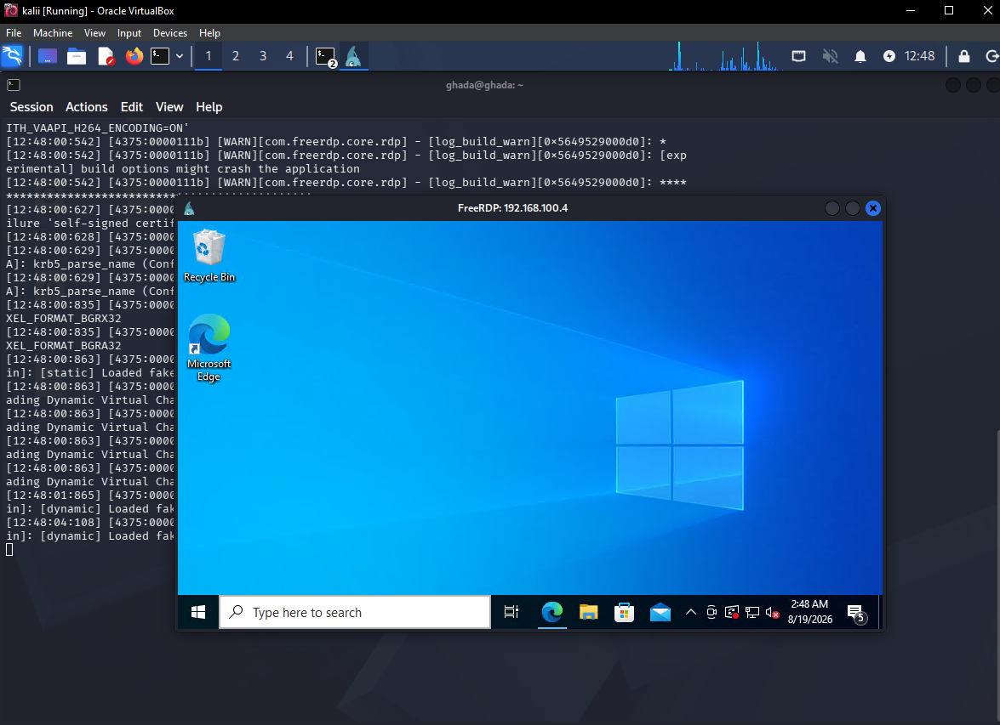
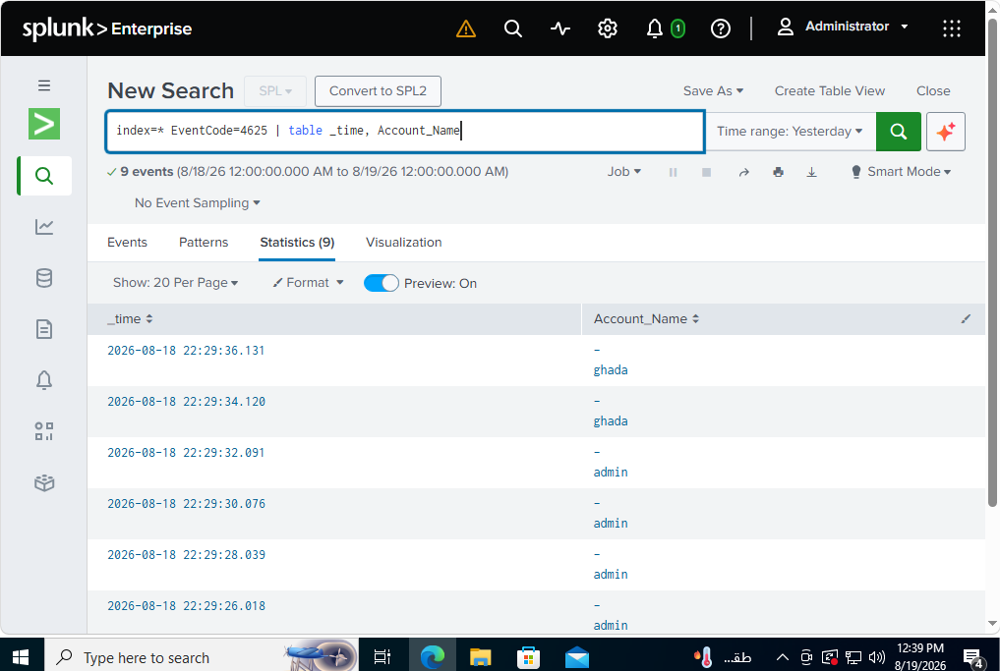
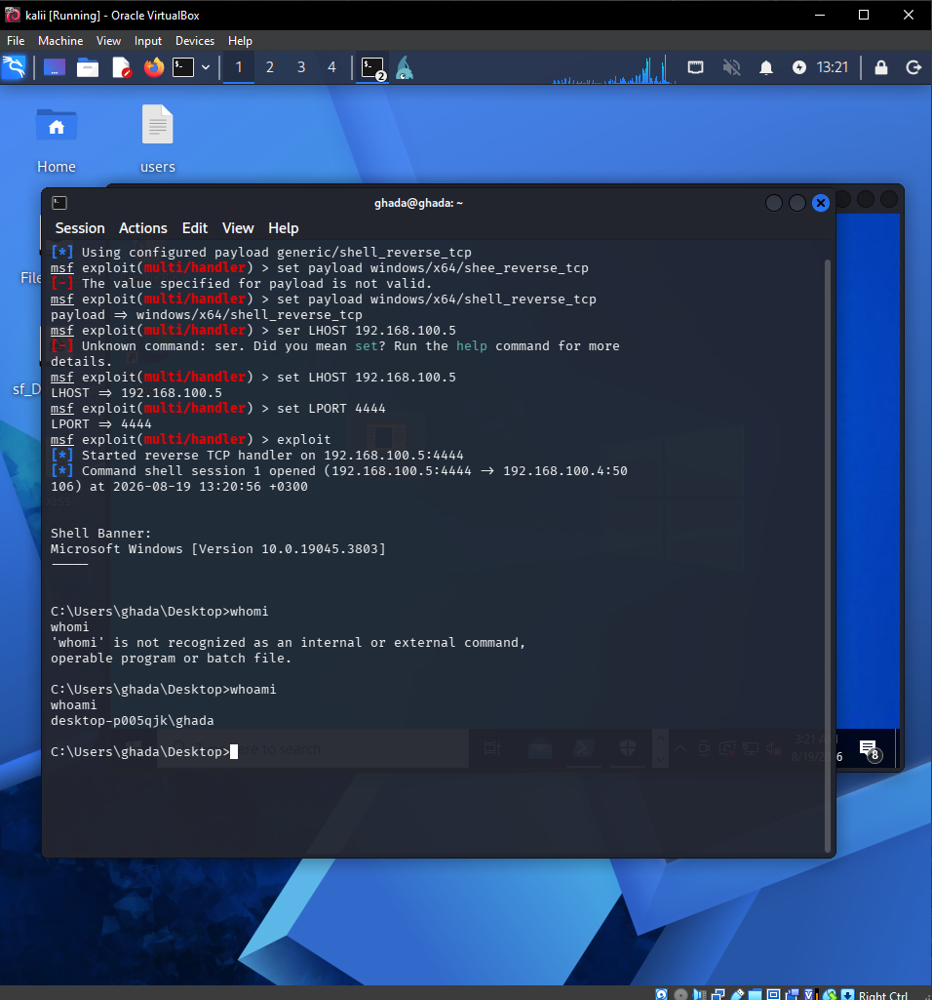
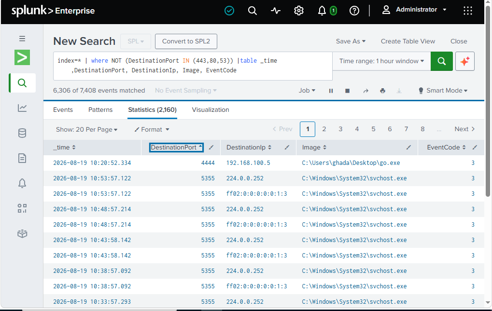

# SOC Home Lab – Security Monitoring & Incident Investigation

## Overview

A hands-on SOC home lab built to simulate, detect, and investigate security incidents using Splunk, Sysmon, Windows, Kali Linux, and Ubuntu Server.

The lab focuses on security monitoring, log analysis, IOC identification, event correlation, and incident investigation from a SOC Analyst L1 perspective.

## Lab Architecture

Kali Linux → Windows 10 → Splunk Universal Forwarder → Ubuntu Server / Splunk Enterprise

### Components

- Kali Linux – Attack Simulation
- Windows 10 – Victim / Monitored Endpoint
- Sysmon – Endpoint Telemetry
- Splunk Universal Forwarder – Log Forwarding
- Ubuntu Server – Splunk Enterprise
- Splunk – SIEM, Detection & Investigation

## Attack Scenarios

### Reconnaissance
- Nmap network reconnaissance
- Sysmon Event ID 3 analysis
- Network connection investigation

### Initial Access – RDP Brute Force

An RDP brute-force attack was simulated from Kali Linux, followed by log analysis in Splunk.

### Exploitation – Metasploit

Metasploit was used to simulate exploitation in the isolated lab environment. The resulting process and network activity were investigated in Splunk.

### Persistence
- Registry Run Key persistence
- Registry modification investigation
- Process execution and network activity correlation

## Skills

- Splunk
- SPL
- SIEM
- Sysmon
- Windows Event Logs
- Log Analysis
- IOC Identification
- Event Correlation
- Incident Investigation
- MITRE ATT&CK
